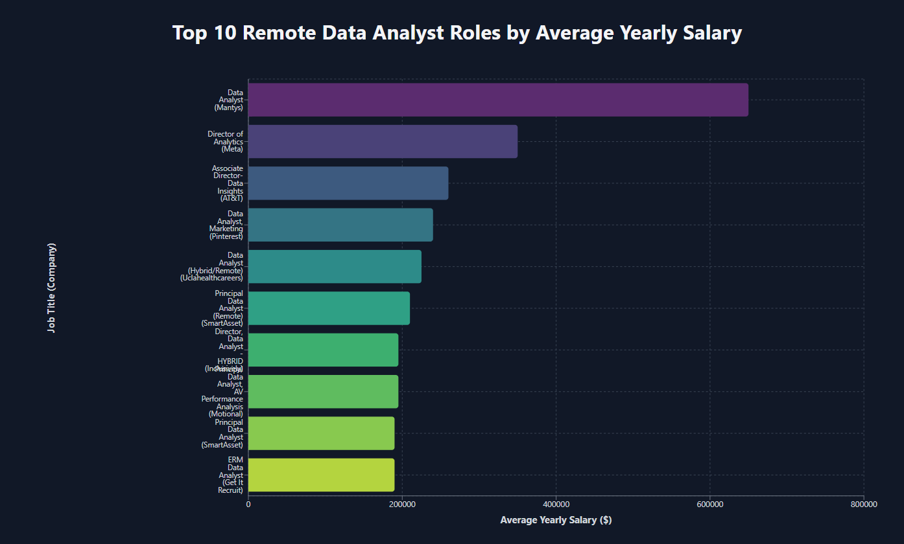
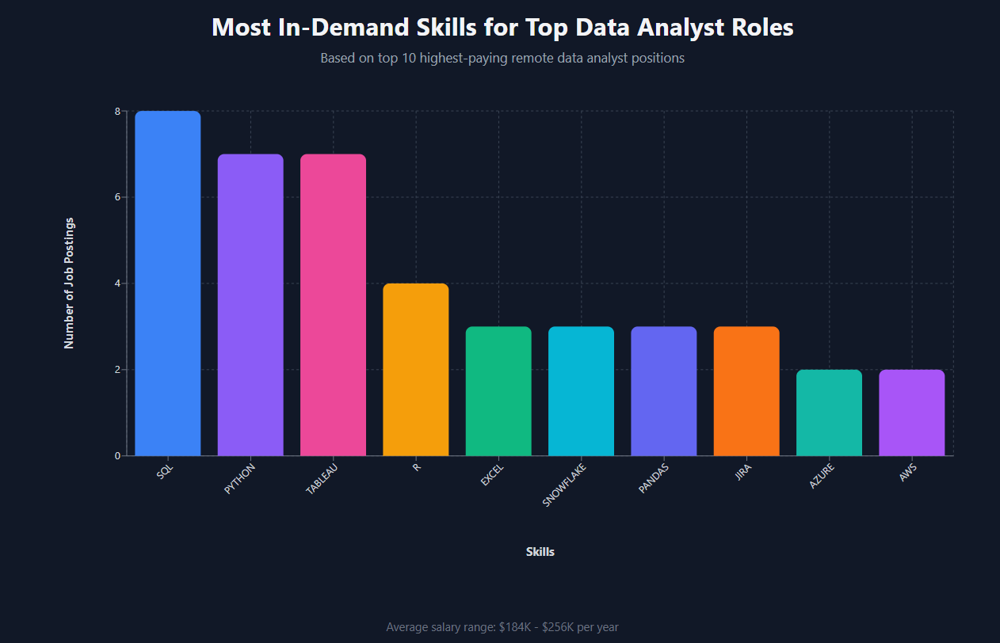
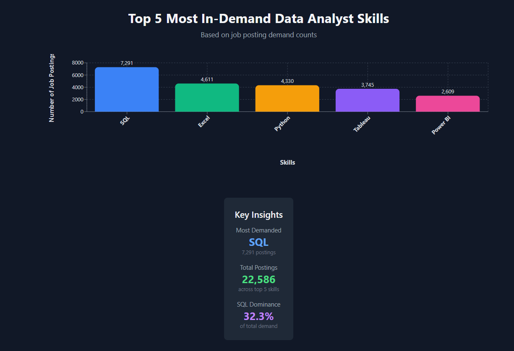
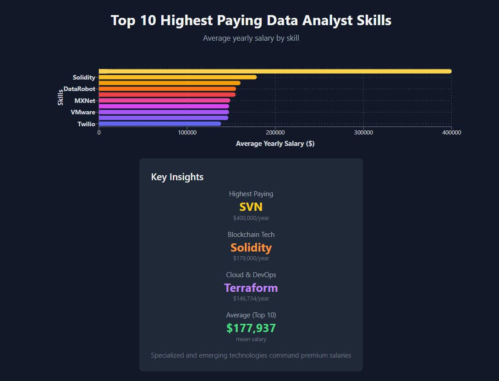
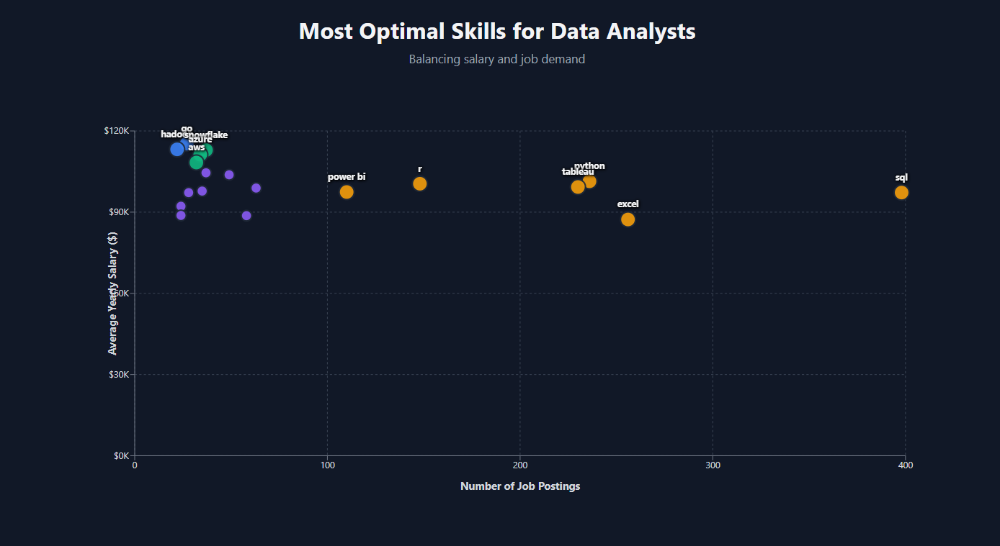
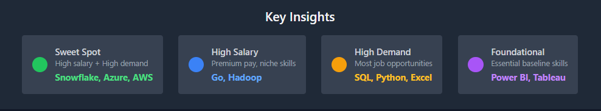

# Data Job Skills & Salary Analysis Project

## INREODUCTION

Dive into the job market for different data roles all over the world. This project analyses job postings focused on Data roles — exploring in-demand skills, salary ranges, and future-proofing for tech professional.

SQL queries? Check them out here: [project_file](/project_file/)

**Note:** The dataset used in this project contains job postings and skill data up to 2023. Insights and trends reflect this timeframe and may have evolved since then.
## BACKGROUND

Born from a drive to better understand the data analyst job market, this project aims to uncover the most valuable and in-demand skills, helping others efficiently identify optimal career opportunities.

### Questions I wanted to answer through my SQL queries were:

1. What are the top paying data(analyst) jobs?
2. What skills are required for these top paying jobs?
3. What skills are most in demand for different data roles?
4. Which skills are associated with higher salaries?
5. What are the most optimal skills to learn?

## TOOLS I USED

To explore the data analyst job market in depth, I relied on a set of powerful tools:

- **SQL** : The heart of my exploration, helping uncover patterns and insights hidden in the data.
- **PostgreSQL** : A reliable database engine that handled large job datasets with speed and precision.
- **Visual Studio Code** : My trusted environment for crafting and running SQL queries with ease.
- **Git & GitHub** : For version control and collaboration — ensuring every step of the project was well-documented and shareable.

<p align="center">
  
  
  
  
  
</p>

## THE ANALYSIS

Each query for this project aimed at investigating specific aspects of the data analyst job market. Here’s how I approached each question:

### 1. Top Paying Data Analyst Jobs

To identify the highest-paying roles, I filtered data analyst positions by average yearly salary and location / work from home, focusing on remote jobs. This query highlights the high paying opportunities in the field.

```sql
SELECT
    job_id,
    job_title,
    job_location,
    job_schedule_type,
    salary_year_avg,
    name AS company_name
FROM
    job_postings_fact
    LEFT JOIN company_dim ON job_postings_fact.company_id = company_dim.company_id
WHERE --Change the job_title_short to specify your desired roles eg. Data Engineer/Data Scientist
    job_title_short = 'Data Analyst'
    --AND job_location = 'Anywhere'--
    AND job_work_from_home = TRUE
    AND salary_year_avg IS NOT NULL
ORDER BY salary_year_avg DESC
LIMIT(10);
```

Here's the visualization:


_Horizontal Bar generated by calude.ai_

Here's the breakdown of the top data analyst jobs:

- Remote Data Analyst roles offer the highest salaries, with positions like Mantys’ Data Analyst reaching $650,000/year.
- Leadership and strategic roles, such as Director of Analytics at Meta, command premium pay.
- Hybrid and specialized roles in marketing, automation, and performance analysis remain highly sought-after and well-compensated.

### 2. Skills for Top Paying Jobs

To understand what skills are required for the top-paying jobs, I joined the job postings with the skills data, providing insights into what employers value for high-compensation roles.

```sql
WITH top_paying_jobs AS(
    SELECT
        job_id,
        job_title,
        salary_year_avg,
        name AS company_name
    FROM
        job_postings_fact
        LEFT JOIN company_dim ON job_postings_fact.company_id = company_dim.company_id
    WHERE --Change the job_title_short to specify your desired roles eg. Data Engineer/Data Scientist
        job_title_short = 'Data Analyst'
        AND job_location = 'Anywhere'
        AND salary_year_avg IS NOT NULL
    ORDER BY salary_year_avg DESC
    LIMIT(10)
)

SELECT
    top_paying_jobs.*,
    skills_dim.skills
FROM top_paying_jobs
INNER JOIN skills_job_dim ON top_paying_jobs.job_id = skills_job_dim.job_id
INNER JOIN skills_dim ON skills_job_dim.skill_id = skills_dim.skill_id;
```

The visualizaton:


_Bar Chart generated by calude.ai_

Here's the breakdown:

- **SQL and Python are essential** : Almost all jobs require them, along with Tableau, Excel, or Pandas.
- **Higher seniority → higher salary** : Directors/Associate Directors ($255k) earn significantly more than mid-level Analysts (~$180k–$232k).
- **Cloud & Big Data matter for senior roles** : AWS, Azure, Databricks, and Snowflake appear mostly in higher-level positions.

### 3. In-Demand Skills for Data Analysts

This query helped identify the skills most frequently requested in job postings, directing focus to areas with high demand.

```sql
SELECT
    skills,
    COUNT(skills_job_dim.job_id) AS demand_count
FROM job_postings_fact
    INNER JOIN skills_job_dim ON job_postings_fact.job_id = skills_job_dim.job_id
    INNER JOIN skills_dim ON skills_job_dim.skill_id = skills_dim.skill_id
WHERE
    /*here you can put your desired data roles and other filters like location, work from home etc*/
    job_title_short = 'Data Analyst'
    AND job_work_from_home = TRUE
GROUP BY skills
ORDER BY demand_count DESC
LIMIT 5;
```

The visualizaton:


_Bar Chart generated by calude.ai_

Here's the breakdown:

- **SQL is the most in-demand skill**, appearing in 7,291 job postings.
- **Excel and Python are close followers**, showing that both analytics and programming are highly valued.
- **Visualization tools matter**, with Tableau (3,745) and Power BI (2,609) in high demand, highlighting the importance of BI skills.

### 4. Skills Based On Salary

Exploring the average salaries associated with different skills revealed which skills are the highest paying.

```sql
SELECT
    skills,
    ROUND (AVG (salary_year_avg), 0) AS avg_salary
FROM
    job_postings_fact
    INNER JOIN skills_job_dim ON job_postings_fact.job_id = skills_job_dim.job_id
    INNER JOIN skills_dim ON skills_job_dim.skill_id = skills_dim.skill_id
WHERE
    /*here you putyour desired data roles and other filters like location, work from home etc*/
    job_title_short = 'Data Analyst' AND
    salary_year_avg IS NOT NULL
GROUP BY skills
ORDER BY avg_salary DESC
LIMIT 10;
```

The visualizaton:


_Chart generated by calude.ai_

Here's the breakdown:

- **SVN** stands out with the highest average salary of $400K, far above all other skills.
- **Emerging tech skills** like **Solidity**, **Couchbase**, and **DataRobot** command strong salaries, showing high demand for niche expertise.
- **Cloud and DevOps** tools such as VMware and Terraform also offer lucrative pay, indicating their critical role in modern infrastructure.
- **Popular skills bring more job opportunities**, while rare specialized skills bring higher pay.
- **The key is balancing both** — master core tools like SQL & Python, and then add a niche skill (e.g., Cloud, AI, or Blockchain) to stand out.

### 5. Most Optimal Skills to Learn

Combining insights from demand and salary data, this query aimed to pinpoint skills that are both in high demand and have high salaries, offering a strategic focus for skill development.

```sql
SELECT
    skills_dim.skill_id,
    skills_dim.skills,
    COUNT(skills_job_dim.job_id) AS demand_count,
    ROUND(AVG(job_postings_fact.salary_year_avg), 0) AS avg_salary
FROM
    job_postings_fact
    INNER JOIN skills_job_dim ON job_postings_fact.job_id = skills_job_dim.job_id
    INNER JOIN skills_dim ON skills_job_dim.skill_id = skills_dim.skill_id
WHERE
    job_title_short = 'Data Analyst'
    AND salary_year_avg IS NOT NULL
    AND job_work_from_home = TRUE
GROUP BY skills_dim.skill_id
HAVING COUNT(skills_job_dim.job_id) > 20
ORDER BY
    avg_salary DESC,
    demand_count DESC
LIMIT 20;
```

The visualizaton:




_Chart generated by calude.ai_

Here's the breakdown:

- **Cloud and data engineering tools pay the most** — Skills like Go ($115K), Hadoop ($113K), and Snowflake ($112K) lead in salary, showing strong demand for cloud and big data expertise.
- **Core analytics skills dominate in demand** — SQL (398), Python (236), Excel (256), and Tableau (230) appear most frequently, proving they’re still essential across roles.
- **Specialized tools offer salary boosts** — While popular skills bring more jobs, niche ones like Snowflake, Looker, and Azure yield higher pay, suggesting value in combining core + specialized skillsets.

## WHAT I LEARNED?

**Advanced SQL Proficiency**: Developed expertise in crafting complex SQL queries, efficiently joining multiple tables, and using WITH clauses to manage temporary datasets for cleaner, modular analysis.

**Data Aggregation & Insight Generation**: Strengthened ability to apply aggregate functions such as COUNT(), AVG(), and SUM() with GROUP BY to produce meaningful, business-ready insights.

**Analytical Problem-Solving**: Enhanced capability to translate real-world data challenges into actionable insights through structured, optimized, and well-documented SQL queries.

## CONCLUSION

###  Key Insights from the Analysis

- **Top-Paying Roles:** Remote data analyst positions can reach salaries as high as $650,000, highlighting the vast potential in this career path.
- **Critical Skill for High Earnings:** SQL consistently appears as the core requirement for top-paying jobs, reinforcing its importance in driving career advancement.
- **Most In-Demand Competency:** With the highest demand across postings, SQL remains the backbone skill for data professionals.
- **High-Value Specialized Skills:** Niche technologies like SVN, Solidity, and Couchbase command premium salaries, showing that rare expertise yields greater rewards.
- **Market-Optimized Skill Set:** Combining foundational tools like SQL and Python with emerging technologies positions analysts for maximum market value and career growth.

###  Closing Thoughts

This project reinforced how data-driven analysis can uncover powerful insights about the job market. Understanding which skills drive both demand and salary potential is essential for professionals aiming to stay competitive. As the data landscape evolves, continuously learning and adapting to new tools will remain key to long-term success in the analytics field.


